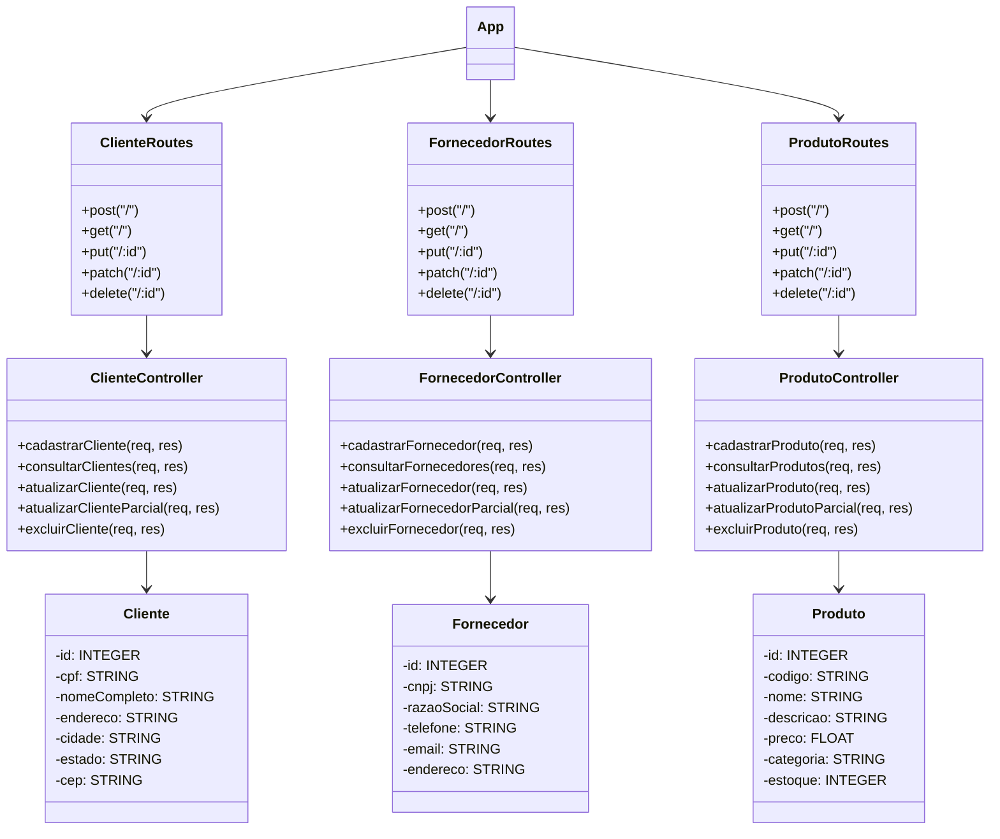
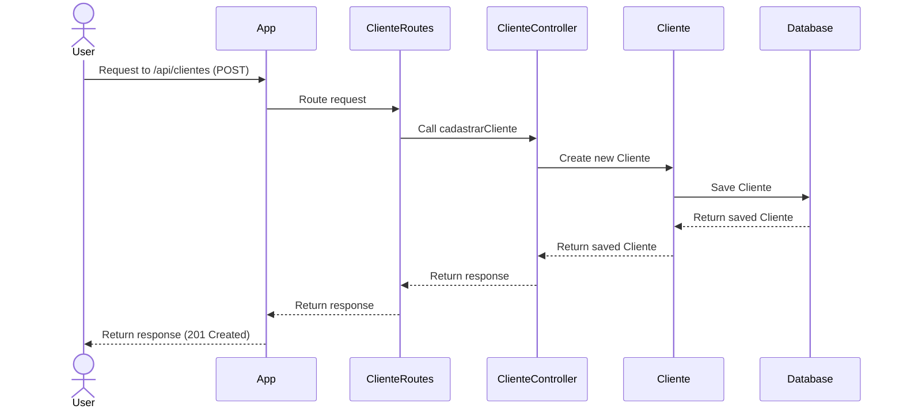
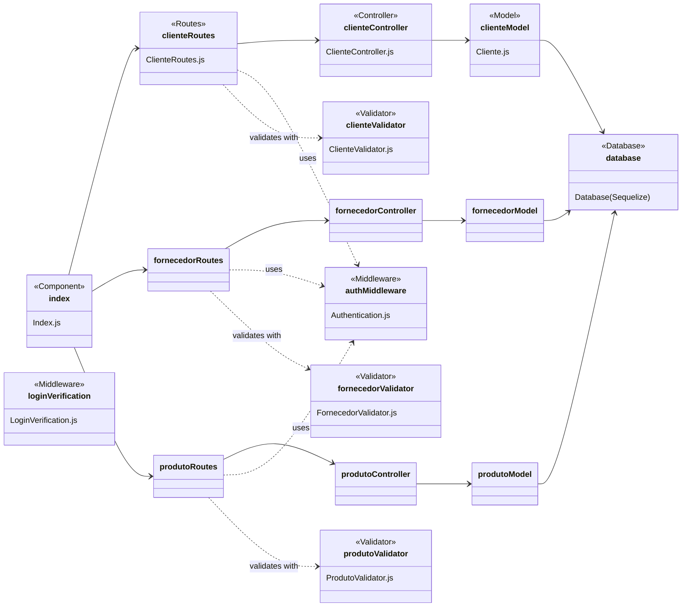

# API REST Backend Node.js - Atividade Programação II

Este projeto foi desenvolvido durante as disciplinas de Programação I e II do curso de Engenharia de Software da Unoeste. A proposta era criar separadamente um frontend e um backend e, ao final, integrar ambos.

## Funcionalidades

Esta API fornece endpoints para gerenciar clientes, fornecedores e produtos. As principais funcionalidades incluem:

- **Clientes**:
  - Cadastro de clientes
  - Consulta de clientes
  - Atualização de clientes (total e parcial)
  - Exclusão de clientes

- **Fornecedores**:
  - Cadastro de fornecedores
  - Consulta de fornecedores
  - Atualização de fornecedores (total e parcial)
  - Exclusão de fornecedores

- **Produtos**:
  - Cadastro de produtos
  - Consulta de produtos
  - Atualização de produtos (total e parcial)
  - Exclusão de produtos

## Endpoints

### Clientes
- `POST /api/clientes`: Cadastrar um novo cliente
- `GET /api/clientes`: Consultar todos os clientes
- `PUT /api/clientes/:id`: Atualizar um cliente
- `PATCH /api/clientes/:id`: Atualizar parcialmente um cliente
- `DELETE /api/clientes/:id`: Excluir um cliente

### Fornecedores
- `POST /api/fornecedores`: Cadastrar um novo fornecedor
- `GET /api/fornecedores`: Consultar todos os fornecedores
- `PUT /api/fornecedores/:id`: Atualizar um fornecedor
- `PATCH /api/fornecedores/:id`: Atualizar parcialmente um fornecedor
- `DELETE /api/fornecedores/:id`: Excluir um fornecedor

### Produtos
- `POST /api/produtos`: Cadastrar um novo produto
- `GET /api/produtos`: Consultar todos os produtos
- `PUT /api/produtos/:id`: Atualizar um produto
- `PATCH /api/produtos/:id`: Atualizar parcialmente um produto
- `DELETE /api/produtos/:id`: Excluir um produto

## Tecnologias Utilizadas

### Bibliotecas Principais

- **Express**: Framework para construção de APIs REST.
- **Sequelize**: ORM para interação com o banco de dados.
- **dotenv**: Carregar variáveis de ambiente a partir de um arquivo `.env`.
- **express-validator**: Middleware para validação de dados.
- **cors**: Middleware para habilitar CORS (Cross-Origin Resource Sharing).

### Banco de Dados

- **MySQL**: Banco de dados relacional utilizado para armazenar os dados da aplicação.

## Diagramas do Projeto

### Diagrama de Classes



### Diagrama de Sequência - Cliente case



### Diagrama de Camada de Apresentação




## Configuração do Projeto

1. Clone o repositório:
   ```sh
   git clone https://github.com/lasbrDev/backend-node-programacao-2.git
    ```
2. Instale as dependências
```bash 
npm install
```
3. Configure as variáveis de ambiente no arquivo *.env*:
```bash
DB_NAME=<nome_do_banco_de_dados>
DB_USER=<usuario_do_banco_de_dados>
DB_PASSWORD=<senha_do_banco_de_dados>
DB_HOST=<host_do_banco_de_dados>
DB_PORT=<porta_do_banco_de_dados>
APP_PORT=<porta_da_aplicacao>
```
4. Inicie a aplicação

```bash
npm start
```

## Licença

Este projeto está licenciado sob a [MIT LICENSE](LICENSE).